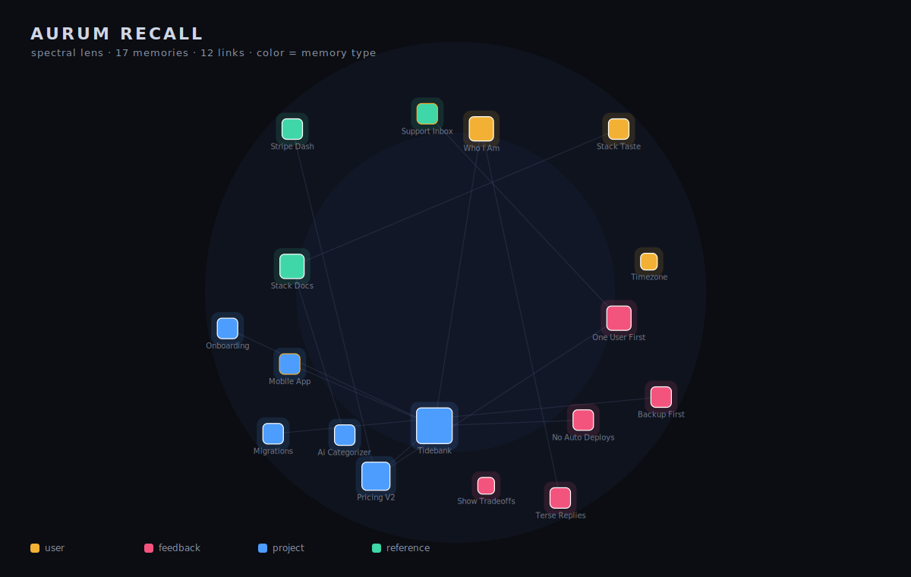

# Aurum Recall — open agent memory

**Memory your agent (and you) can actually read.**

<p align="center">
  
</p>

<p align="center"><sub>A demo store through the <b>spectral lens</b> (<code>aurum-recall-lens</code>): color = memory type, each tile = a memory, lines = <code>[[links]]</code>. Click any tile in the live HTML to focus its layer.</sub></p>

AI agents forget everything between sessions. The dominant fix — dump the conversation into a
vector database and retrieve by embedding similarity — makes memory **opaque, unownable, and
un-auditable**. You can't open it, correct a wrong belief, see why something was recalled, or take
it with you. It's a black box bolted to the side of the agent.

Aurum Recall is the other design: memory as a **maintained, human-readable knowledge base the agent
curates itself** — a folder of small typed Markdown files, a compact always-in-context index,
explicit links between facts, and trust that decays as facts age. Not a database. A notebook the
agent writes and you can read over its shoulder.

> This is not a whiteboard idea. It is the memory system running a fleet of Claude agents across a
> physical cluster today — dogfooded daily. **This spec was written by an agent recalling from the
> very system it describes.**

---

## Why this design wins

| | Vector-DB memory (Mem0 / Zep / Letta) | **Aurum Recall** |
|---|---|---|
| Readable by a human | ❌ embeddings | ✅ plain Markdown |
| Correctable / deletable | hard | ✅ edit or delete a file |
| Explainable recall | similarity score | ✅ you see the index line that matched |
| Ownable / portable | vendor DB | ✅ your files, git-native |
| Typed & provenanced | rarely | ✅ user / feedback / project / reference + dates |
| Handles staleness | no | ✅ age → trust decay, "verify before trusting" |
| Self-maintaining | no | ✅ the agent writes/updates/forgets by rules |
| Recall cost | embed + ANN search | ✅ scan a tiny index; load full docs on demand |

The wedge isn't "better retrieval." It's **memory as a first-class, inspectable, sovereign
artifact** — which is exactly what regulated, privacy-sensitive, and self-hosting users can't get
from a hosted vector store.

---

## The shape (60-second version)

```
memory/
  MEMORY.md            ← the index: one line per memory, ALWAYS loaded into context
  user_who_i_am.md     ← one fact per file, typed frontmatter, [[links]] to others
  feedback_no_updates.md
  project_launch_q3.md
  reference_billing_dashboard.md
```

- **The index is the working set.** `MEMORY.md` holds one scannable line per memory and is loaded
  every session. The agent reads the *descriptions*, decides what's relevant, and pulls the full
  file **on demand**. Recall is O(index), not O(embeddings).
- **One fact per file, typed.** Each memory is a single durable fact with frontmatter
  (`name`, `description`, `type`) and a body. Types: **user** (who they are), **feedback**
  (how to work / corrections, with the *why*), **project** (ongoing work not in the code),
  **reference** (pointers to external resources).
- **A graph, not a pile.** Facts link with `[[name]]`. A link to a memory that doesn't exist yet is
  a valid to-do, not an error.
- **Trust decays.** Every recalled fact carries its age; old ones surface with a
  "verify before trusting" flag. Memory ages like memory.
- **The agent curates.** Write-discipline is part of the protocol: one fact per file, update don't
  duplicate, delete when wrong, don't store what the code already says.

Full contract in [`SPEC.md`](./SPEC.md). Phased build in [`BUILD_PLAN.md`](./BUILD_PLAN.md).

---

## Where it goes

1. **OSS core** — a drop-in library + MCP server any agent (Claude, GPT, local) uses to remember.
2. **A visual lens** — the memory graph rendered as a **spectral / fractal map**: color = memory
   type, each tile addresses a fact, zoom reveals its links and deeper context. (Aurum's
   fractal-QR / O(1)-addressing IP is a *view* over this substrate, not a separate system.)
3. **Shared memory for teams of agents** — hosted sync so a fleet shares one curated, consented
   knowledge base (the cluster use-case, productized). This is the monetization tier; the core
   stays free and sovereign.

**Principle that never bends:** the memory is the user's, in the open, on their terms. We sell
sync, scale, and the lens — never lock-in on the facts themselves.

---

*Aurum Nebula LLC · seeded 2026-07-12 · [`SPEC.md`](./SPEC.md) · [`BUILD_PLAN.md`](./BUILD_PLAN.md)*
