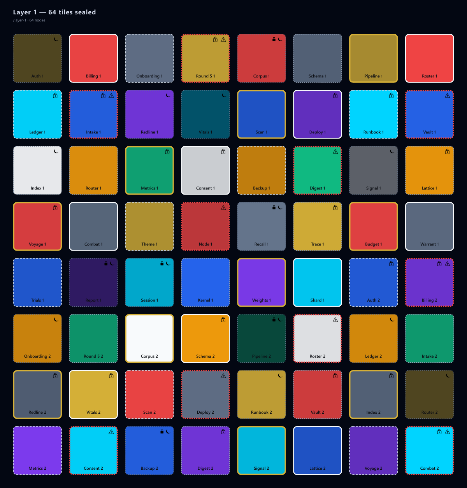

# Aurum Recall

**AI-native memory you and your agent can actually read — and navigate.**

Two layers, one system:

1. **The Store** — sovereign, human-readable, self-curating memory: typed Markdown files + an
   always-in-context index + `[[links]]` + trust-decay. A library and an **MCP server**.
2. **The Lattice** (ContextQR) — a visual **routing** layer over that store: color-coded context
   tiles, trust borders, and a real scannable **root QR**. *Route before you retrieve.*

<p align="center">
  
</p>
<p align="center">
  
</p>
<p align="center"><sub>An 8×8 memory layer — 64 crystallized context tiles (<b>color</b> = type · <b>border</b> = trust · <b>🔒</b> = private · <b>faded</b> = stale) · and the real scannable root QR</sub></p>

> The store is where memory lives. The lattice is how an agent flies through it — narrowing to the
> right branch, respecting privacy and freshness, and pulling only what it needs, *before* spending
> tokens on retrieval.

---

## Why

Vector-DB memory is opaque, unownable, and un-auditable — and RAG retrieves text *first*, with no
cheap way to route. Aurum Recall inverts both:

```
Vector RAG:   Question → embedding search → maybe-relevant chunks → answer
Aurum Recall: Question → route the lattice → narrow the branch → search inside it → verify → answer
```

You get lower token use, real privacy boundaries, first-class trust/freshness/provenance, and a
memory that is **your files, in the open, on your terms.**

**Context windows do not expire. They crystallize into recursive memory tiles.** When an agent's
context fills, it compresses into a tile; 64 tiles seal into an 8×8 layer; layers hash-chain
(Merkle) and recurse. The architecture: **[`CONCEPT.md`](./CONCEPT.md)**.

---

## The Store

- One durable fact per file, typed (`user` / `feedback` / `project` / `reference`), with a
  one-line hook. `MEMORY.md` is the always-loaded index — the working set. Full format:
  **[`SPEC.md`](./SPEC.md)**.
- Zero-dependency core: `recall / remember / update / forget / link / compact`. Trust decays with age.
- **MCP server** — one config line and any MCP agent (Claude Desktop, Claude Code) gets durable,
  inspectable memory. See **[`QUICKSTART.md`](./QUICKSTART.md)**.

```bash
npm install && npm run build && npm test
```

## The Lattice (ContextQR)

Build a routable visual lattice **from a real memory store**, render it, and mint the root QR:

```bash
node dist/lattice/cli.js from-store <memory-dir>            --out lattice.json
node dist/lattice/cli.js validate  lattice.json
node dist/lattice/cli.js render    lattice.json            --out map.svg
node dist/lattice/cli.js qr        lattice.json            --out root_qr.png
node dist/lattice/cli.js subtree   lattice.json ctx_type_project --out projects.svg
node dist/lattice/cli.js inspect   lattice.json ctx_type_project
```

**Color** = context type · **border** = trust level · **brightness** = freshness · **marker** =
machine-readable pointer. Only the root is a literal scannable QR; deeper tiles are recursive
routers, not nested pixels.

**The moat** isn't QR codes — it's the combination: *visual context routing + context
crystallization + recursive 8×8 layers + trust/freshness/privacy metadata + hash-verifiable
provenance + agent navigation before retrieval.*

---

## Open core

**Public (the credibility layer, this repo):** the memory store + MCP server + lens, and the
lattice — schema, validator, SVG renderer, root QR, CLI, the store→lattice importer, and the
concept paper.

**Private (the commercial layer, not built in public):** the production routing engine, memory &
compression heuristics, trust/freshness/privacy scoring logic, persistence, cloud service, and
product integrations (Nomad, the AgentX-Ray "Context Navigation" benchmark).

*Apache-2.0 · Aurum Nebula LLC · [`SPEC.md`](./SPEC.md) · [`CONCEPT.md`](./CONCEPT.md) · [`BUILD_PLAN.md`](./BUILD_PLAN.md)*
